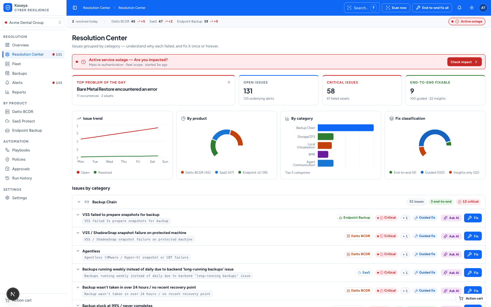
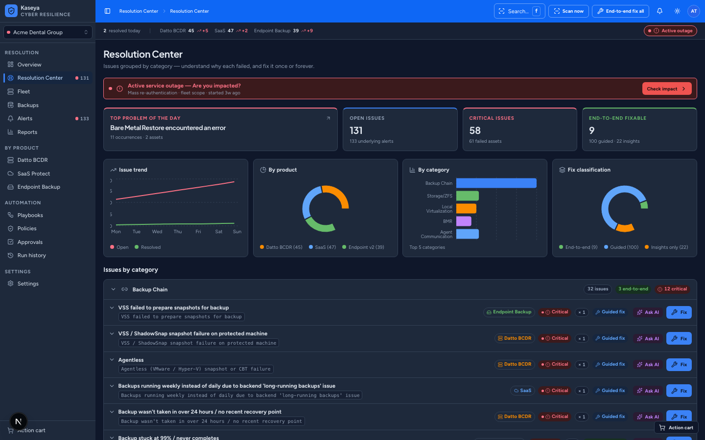
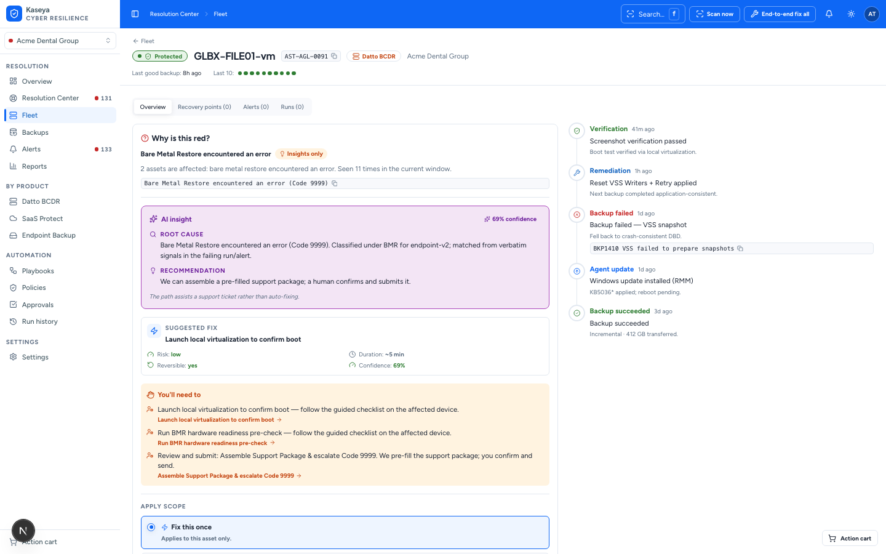
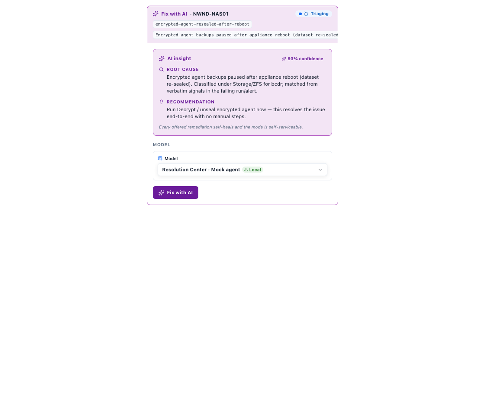
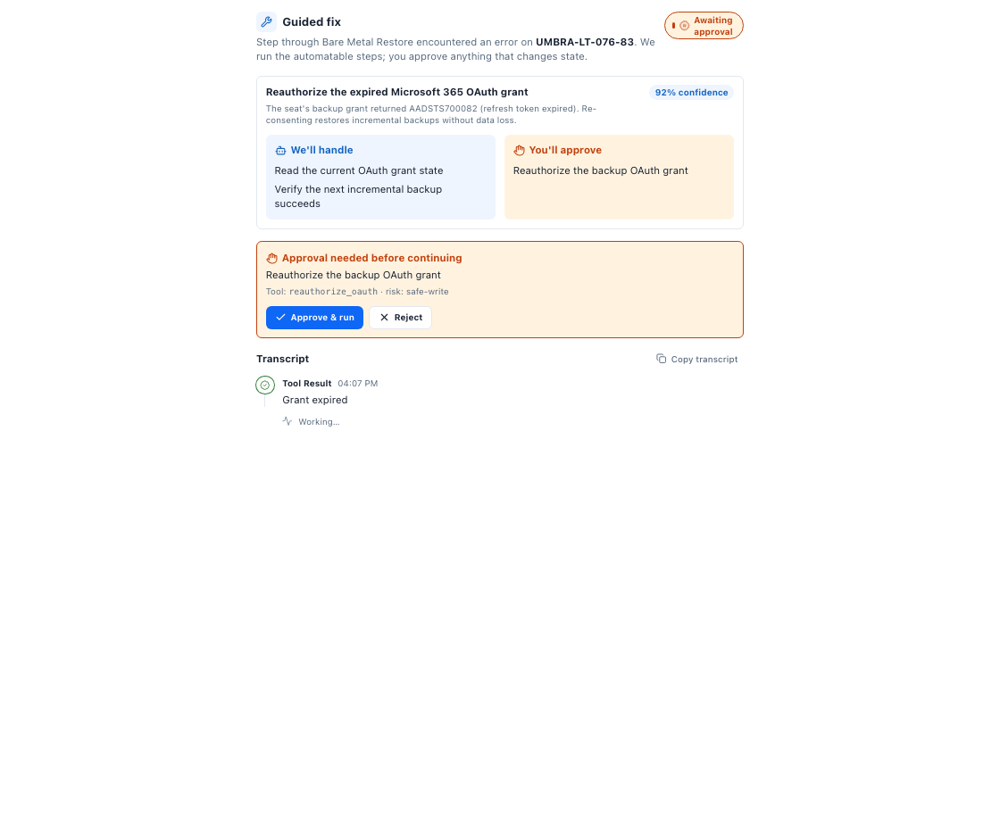

<div align="center">

# Kaseya Resolution Center

**Troubleshooting-first automation for the Datto/Kaseya data-protection stack.**
Turn a wall of red "backup failed" alerts into ranked, explained, *fixable* issues —
and fix them once or forever, without opening a vendor ticket.




</div>

## What this is

The **Kaseya Resolution Center** is a module inside the Kaseya/Datto portal where an MSP
technician goes *when something is wrong*. It is health-aware but it is **not a dashboard** —
it groups failures **by category**, explains *why* each one happened, and runs the **fix**.

Every issue carries a **fix classification** that sets expectation and the available action:

| | Fix type | Meaning |
|---|---|---|
| 🟢 | **End-to-end fix** | fully automatable — one click (or bulk "fix all") |
| 🔵 | **Guided fix** | some steps automated (**"We"**), some manual (**"You"**) |
| 🟠 | **Insights only** | not controllable (vendor/infra) — diagnosis + runbook |

The spine of the product is **fix once → fix forever**: a single remediation → chain →
saved **playbook** → standing **auto-remediation policy**. A simulated runner actually
executes chains, an action cart persists across routes, and approvals gate the risky stuff.

> **This is a front-end mock.** No backend or live product APIs — data comes from a seeded,
> deterministic generator (**135 real failure modes, 154 remediation actions, ~300 correlated
> assets**) so every screen is populated with believable Datto/Kaseya content.

## Screenshots

| Resolution Center (dark) | Asset detail — the fix flow |
|---|---|
|  |  |

The asset detail page is the signature flow: **red status → evidence (verbatim error) →
We/You steps → apply once / to all matching / always.**

## AI remediation — Guided fix &amp; Fix with AI

A model-flexible, tool-calling **agent that actually resolves failures** (real loop, simulated
targets) lives in [`fix-engine/`](fix-engine) — a standalone Node package with a CLI and a local
HTTP/SSE server. It triages with read-only diagnostics, emits **real PowerShell / bash / Graph
artifacts**, dry-runs them, executes against a simulated fleet, and verifies — streaming the whole
thing into the UI. Providers: Anthropic · OpenAI-compatible · Gemini · local (Ollama/vLLM) · an
always-on deterministic Mock (so it runs offline with no keys). Design spec:
[`docs/fix-engine/INDEX.md`](docs/fix-engine/INDEX.md).

| Fix with AI (autonomous) | Guided fix (human-in-the-loop) |
|---|---|
|  |  |

## Tech stack

Next.js 15 (App Router) · TypeScript · Tailwind v4 · shadcn/ui (Radix) · lucide-react ·
Storybook 10 · TanStack Table · Zustand (+persist) · nuqs · Recharts · Sonner.
Everything is driven by a **design-token system** in `src/app/globals.css` (light + slate dark).

## Where things live

```
src/
├─ app/(console)/        Routes — the app shell + every screen (Resolution Center,
│                        Fleet, Asset detail, Overview, per-product lenses, Automation…)
├─ app/globals.css       The token system — the single source of color/space/type (M1)
├─ components/
│  ├─ ui/                32 shadcn primitives (+ a story each)
│  ├─ atoms/             9 status/mono/fix atoms (StatusBadge, BackupDotStrip…)
│  ├─ molecules/         15 composed units (We/You steps, apply-scope, KPI tile…)
│  └─ organisms/         29 app surfaces (DataTable, RemediationPanel, AppSidebar…)
├─ stories/foundations/  Token / typography / icon / status reference stories
├─ mock/                 Seeded engine — generators, fixtures, query, simulated runner
│  └─ reference/         135 failure modes + 154 remediation actions
├─ stores/               8 Zustand stores (action cart, playbooks, policies, approvals…)
├─ lib/ · config/ · types/   status+format helpers · nav/products · domain types
└─ docs/                 The spec set (vision → personas → data model → page specs)
```

The component library is **atomic** (Foundations → Atoms → Molecules → Organisms → Pages)
and ships as part of the product: **84/84 components have a Storybook story.**

## Getting started

```bash
npm install
npm run dev            # app on http://localhost:3000
npm run storybook      # component library on http://localhost:6006
```

### Build & deploy (static)

```bash
npm run build          # static export → ./out  (deploys to any static host)
npx wrangler pages deploy out   # e.g. Cloudflare Pages
```

## Quality

- **Accessibility:** WCAG 2.2 AA verified with axe-core across all routes in light **and** dark
  (0 serious/critical violations). Status is never color-only (dot + icon + label).
- **Type-safe:** `tsc --noEmit` clean. **Storybook coverage:** 84/84 components storied.
- **Tokens only:** no hard-coded colors/spacing in component code — enforced by the
  impeccable design hook.

## Status

Built and verified: the full design system, the seeded domain/mock engine, and all primary
screens (Resolution Center, Fleet + asset detail, Overview, per-product lenses, Incident
detail, Reports, Alerts, Backups, Automation, Settings) with light/dark + empty/loading/error
states. Optional next surfaces: appliance/tenant child-detail pages, quick-peek sheet,
global-search results.

## For contributors

`docs/` holds the full specification set ([`docs/INDEX.md`](docs/INDEX.md)). Design language
lives in [`DESIGN.md`](DESIGN.md); the engineering contract (tokens-only, Storybook-first,
a11y, mock-only) is in [`CLAUDE.md`](CLAUDE.md).
